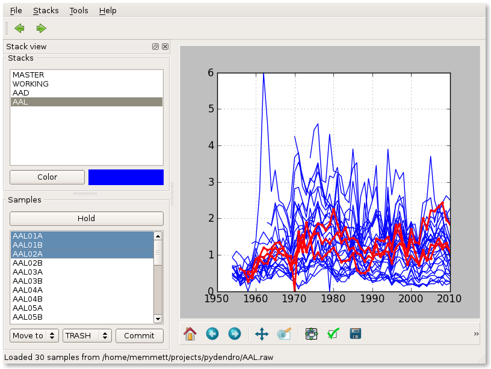

Examples
========

Reading RWL files
-----------------

To load an RWL file containing ring width measurements::

>>> import pydendro.rwl
>>> rwl = pydendro.rwl.read('site1.rwl')

As this point, ``rwl`` is a list of Sample objects.  Each Sample
object has several attributes:

* ``name`` - sample name
* ``fyog`` - first year of growth
* ``widths`` - list of ring width measurements
* ``years`` - list of years
* ``nyears`` - number of years
* ``lyog`` - last year of growth

From here you can use Pythons rich set of datastructures to work with
your data.  For example, to build a dictionary of the samples keyed by
their name::

>>> samples = { x.name: x for x in rwl }

Now you can fun stuff like print the first year of growth of the 'AAAD01' tree:

>>> print samples['AAAD01'].fyog

Graphical analysis
------------------

PyDendro also comes with a graphical user interface to load ring
widths from multiple sources, plot the ring widths and shift them
through time, move samples between stacks, and save the results.

To run the UI, you need the PyQt4 bindings and matplotlib.

To start the UI, run the ``pydendroui`` script.

Here is a quick screen shot:

